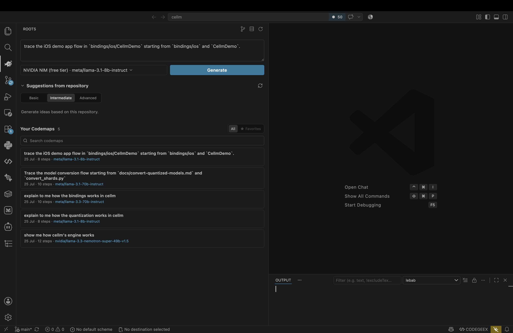
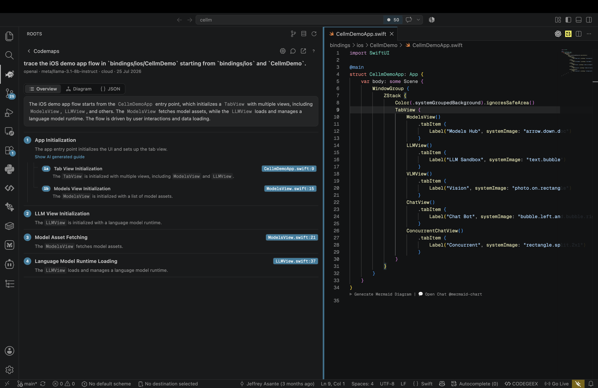
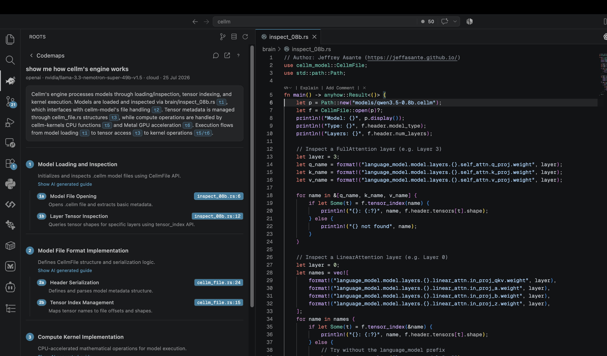
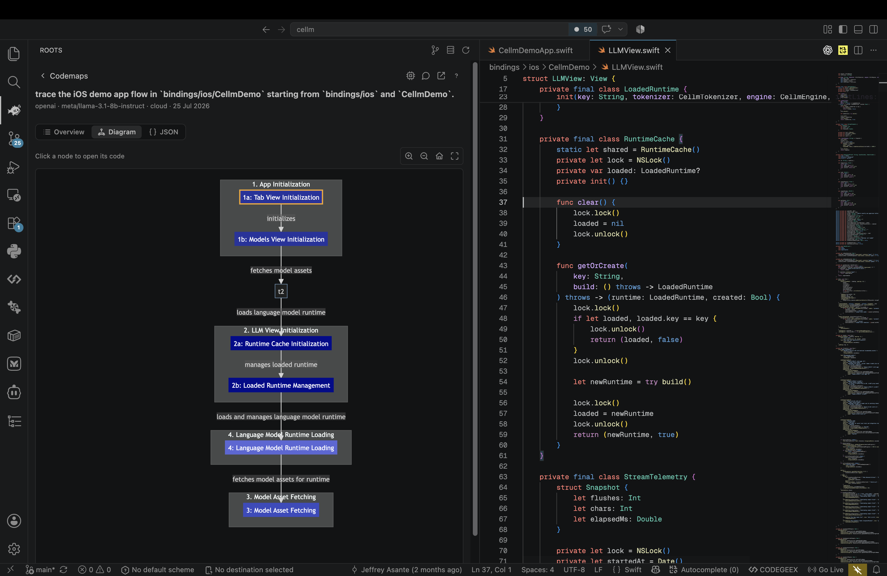
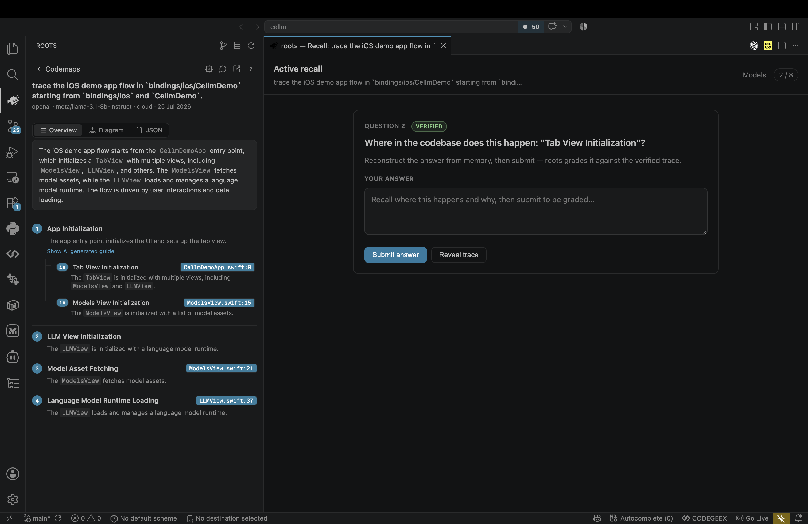

# roots — AI-annotated codemaps for VS Code

roots generates **task-specific, line-grounded codemaps** of a codebase — nested,
file-linked traces of how a feature or flow works, with an optional mermaid diagram.
The model layer is pluggable so you can compare cloud LLMs against local models.

## Preview

**Generate a codemap** — describe a task, pick a backend, and roots researches the
repo and synthesizes a codemap. It also suggests starting points from your repository:



**Read the codemap** — a plain-language overview with clickable `[t1]` references,
followed by nested, numbered traces (`1`, `1a`, `1b`…) and clickable `file:line`
badges:



**Jump to code** — click any `file:line` badge or reference to open the exact
location in the editor:



**See the flow as a diagram** — switch to the diagram view to see how the steps
connect, and click a node to open its code:



**Lock it in with active recall** — turn any codemap into a graded recall quiz that
the model checks against the verified trace:



> Design is inspired by [Windsurf Codemaps](https://cognition.com/blog/codemaps):
> just-in-time, line-grounded maps for a specific task, with a text ⇄ diagram toggle
> and expandable trace guides.

## Layout

```
roots/
  schema/codemap.schema.json     # the portable .codemap contract
  packages/
    engine/                      # TypeScript engine (tools, agent, backends, store, RPC server)
    vscode/                      # VS Code adapter (command, tree view, webview)
```

## Architecture

- **Engine** — a standalone Node process. Read-only analysis tools (grep/find/list/read),
  a two-phase agent (research → synthesis), a codemap store (`.roots/codemaps/*.json`),
  and a pluggable backend interface. Speaks newline-delimited JSON-RPC 2.0 over stdio.
- **Adapter** — the VS Code extension spawns the engine and talks to it over stdio.
  Commands, a sidebar tree (codemaps → traces → locations), jump-to-line, and a
  webview that renders **mermaid diagrams and LaTeX math** (KaTeX). Trace summaries
  can use `$...$` for inline and `$$...$$` for block math; a malformed diagram never
  blocks the rest of the panel.

A standalone preview harness lives in [`examples/preview-lab/index.html`](examples/preview-lab/index.html)
— open it in a browser to see mermaid + LaTeX rendering together with sample data.

Keeping the engine out-of-process isolates the "read your code" trust boundary and
CPU-heavy work from the extension host, and leaves room for a Rust port + Zed adapter later.

## Grounding suggestions with hub detection

When roots suggests what to explore, a flat list of files is useless — it can't tell
you *which* files matter or *where to start*, so you get vague guesses like "there are
Python scripts that talk to Rust code." To fix that, the engine ranks files by how
**central** they are before handing them to the model.

The idea is **hub detection**. Treat the repo as a graph: every `import`/`require` is
an arrow from one file to another. Files that many others import — a shared client, core
logic, a main data structure — are the **hubs**; files nobody imports are leaves. So the
engine:

1. Scans the codebase for `import` / `require` statements.
2. Builds a table of *who imports whom* — for each file, how many files import it.
3. Takes the top ~6 most-imported files.
4. Feeds those to the model as "these are the central files, start here" — so a
   suggestion becomes "trace how `engineClient.ts` (imported by 9 files) drives the
   flow" instead of a random grab-bag.

Three things keep it honest:

- **Barrel/type-only files are excluded.** `index.ts` re-export barrels and pure type
  modules get imported by everyone but hold no behavior — ranking by raw count would
  surface plumbing. They're filtered so behavioral files rank above `types.ts`.
- **Cycle-safe by construction.** Import graphs loop (A imports B, B imports A), so the
  engine computes a flat importer *count* with a self-import guard — no graph traversal,
  no infinite loops.
- **It's a hint, not a fact.** Hub ranking only shapes the *prompt*; it never becomes a
  claim in the codemap output. Trustworthiness is a separate concern handled by the
  `location_verified` / `summary_grounded` fields, which check every claim against the
  real code before it's surfaced.

In one line: roots figures out which files are *important* by counting how many files
depend on them, so its suggestions point at real central code instead of guessing.

> Languages today: TypeScript/JavaScript (`import` / `require`), Python (`import` /
> `from … import`), and Rust (`use crate::` / `mod`). Each is a small `LanguageParser`
> (import extraction + per-language barrel exclusion — `index.ts`, `__init__.py`,
> `mod.rs`/`lib.rs`) dispatched by file extension, so adding Go or Java is one more
> parser, not a rewrite. Resolution is a deliberately cheap module-token match, not full
> `sys.path` / crate-tree / tsconfig resolution — hub ranking is a prompt hint, so
> approximate matching is the right cost/accuracy trade.

## Backends

Bring your own key. The engine ships a catalog the UI lists:

| Backend | Mode | Notes |
| --- | --- | --- |
| Anthropic (Claude) | cloud | API key |
| OpenAI | cloud | API key |
| NVIDIA NIM | cloud | OpenAI-compatible, free tier |
| Groq | cloud | OpenAI-compatible |
| Ollama | local | no key, needs Ollama running |
| [cellm](https://github.com/jeffasante/cellm) | local | cellm sidecar (OpenAI-compatible), the differentiator |

Keys are stored in VS Code SecretStorage, never written to disk or logs.

## The `.codemap` format

A portable, git-trackable JSON artifact. Every codemap self-reports which backend/model
produced it, so results are diffable across backends on the same query. See
[`schema/codemap.schema.json`](schema/codemap.schema.json).

## Develop

```bash
npm install
npm run build          # builds engine then adapter
```

Then in VS Code: run the `roots-vscode` extension (F5), open the **roots** view in the
activity bar, and run **roots: Generate Codemap**.

Run the engine standalone (for scripting / eval):

```bash
npm run engine         # starts the JSON-RPC stdio server
```

## Status

Phase 0 (engine core) + partial Phase 1 (adapter MVP).
Next: eval harness, editor decorations, and richer webview navigation.
