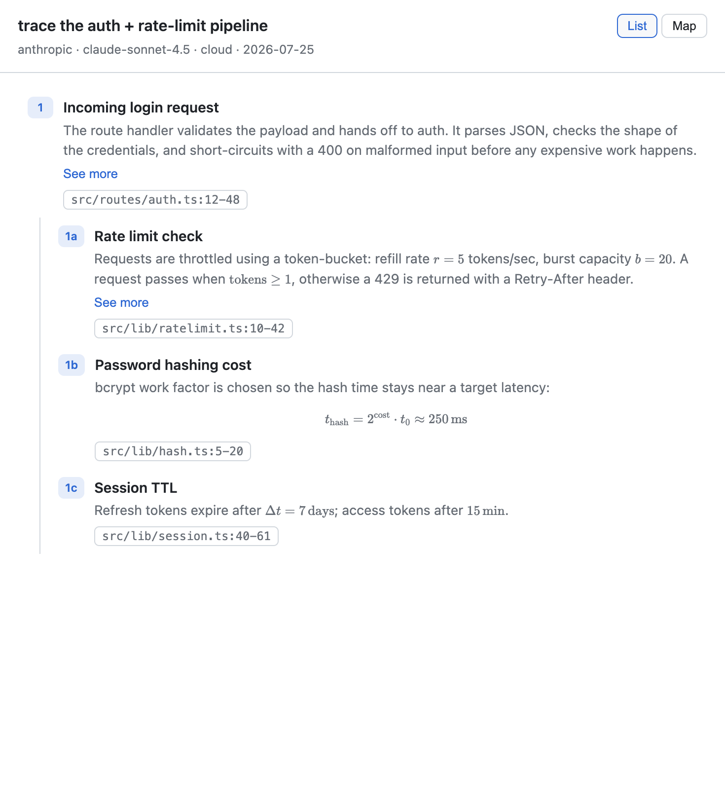
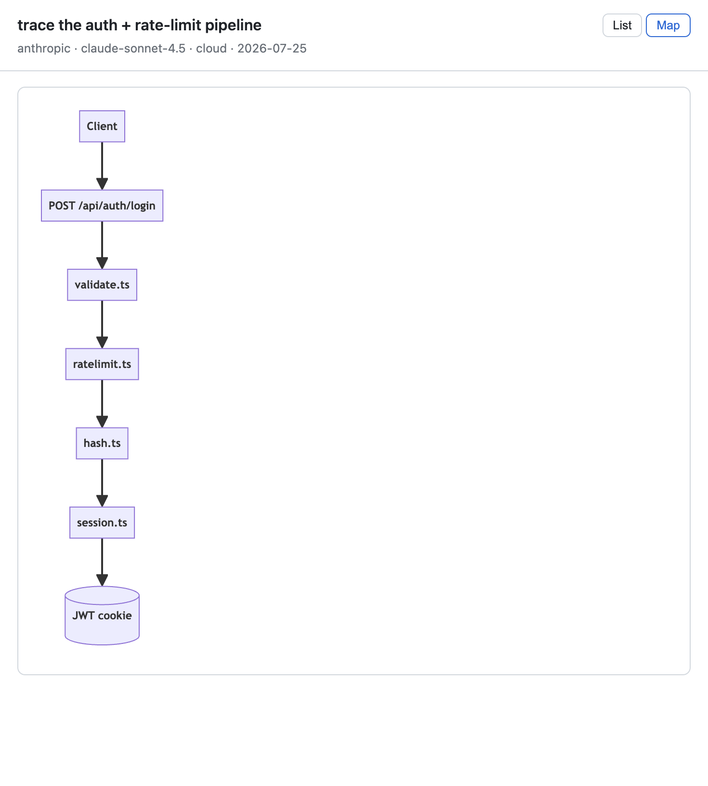

# roots — AI-annotated codemaps for VS Code

roots generates **task-specific, line-grounded codemaps** of a codebase — nested,
file-linked traces of how a feature or flow works, with an optional mermaid diagram.
The model layer is pluggable so you can compare cloud LLMs against local models.

Built from [`roots-blueprint-v1.md`](roots-blueprint-v1.md).

## Preview

The codemap panel has two views you can toggle in the header.

**List view** — nested, numbered traces (`1`, `1a`, `1b`…) with a "See more"
guide toggle, clickable `file:line` badges that jump to the code, and inline/block
LaTeX rendered via KaTeX:



**Map view** — the same codemap rendered as a mermaid diagram; clicking a node
maps back to the code:



> Design is inspired by [Windsurf Codemaps](https://cognition.com/blog/codemaps):
> just-in-time, line-grounded maps for a specific task, with a text ⇄ diagram toggle
> and expandable trace guides.

## Layout

```
roots/
  schema/codemap.schema.json     # the portable .codemap contract
  packages/
    engine/                      # TypeScript engine (tools, agent, backends, store, RPC server)
    vscode/                      # VS Code adapter (command, tree view, webview)
```

## Architecture

- **Engine** — a standalone Node process. Read-only analysis tools (grep/find/list/read),
  a two-phase agent (research → synthesis), a codemap store (`.roots/codemaps/*.json`),
  and a pluggable backend interface. Speaks newline-delimited JSON-RPC 2.0 over stdio.
- **Adapter** — the VS Code extension spawns the engine and talks to it over stdio.
  Commands, a sidebar tree (codemaps → traces → locations), jump-to-line, and a
  webview that renders **mermaid diagrams and LaTeX math** (KaTeX). Trace summaries
  can use `$...$` for inline and `$$...$$` for block math; a malformed diagram never
  blocks the rest of the panel.

A standalone preview harness lives in [`examples/preview-lab/index.html`](examples/preview-lab/index.html)
— open it in a browser to see mermaid + LaTeX rendering together with sample data.

Keeping the engine out-of-process isolates the "read your code" trust boundary and
CPU-heavy work from the extension host, and leaves room for a Rust port + Zed adapter later.

## Backends

Bring your own key. The engine ships a catalog the UI lists:

| Backend | Mode | Notes |
| --- | --- | --- |
| Anthropic (Claude) | cloud | API key |
| OpenAI | cloud | API key |
| NVIDIA NIM | cloud | OpenAI-compatible, free tier |
| Groq | cloud | OpenAI-compatible |
| Ollama | local | no key, needs Ollama running |
| cellm | local | cellm sidecar (OpenAI-compatible), the differentiator |

Keys are stored in VS Code SecretStorage, never written to disk or logs.

## The `.codemap` format

A portable, git-trackable JSON artifact. Every codemap self-reports which backend/model
produced it, so results are diffable across backends on the same query. See
[`schema/codemap.schema.json`](schema/codemap.schema.json).

## Develop

```bash
npm install
npm run build          # builds engine then adapter
```

Then in VS Code: run the `roots-vscode` extension (F5), open the **roots** view in the
activity bar, and run **roots: Generate Codemap**.

Run the engine standalone (for scripting / eval):

```bash
npm run engine         # starts the JSON-RPC stdio server
```

## Status

Phase 0 (engine core) + partial Phase 1 (adapter MVP) per the blueprint roadmap.
Next: eval harness, editor decorations, and richer webview navigation.
