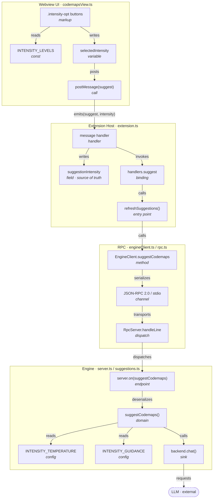

# Roots Codemap Graph — Suggestion Intensity Feature

## Investigation Log

```
✓ Searched:  "suggestCodemaps"                    → 2 files
✓ Searched:  "suggestCodemaps|createBackend|server.on"  (engine)
✓ Searched:  "suggest:|refreshSuggestions"        (extension)
✓ Searched:  "class RpcServer|on(|dispatch|handle"
✓ Opened:    suggestions.ts        (L1-120)
✓ Opened:    engineClient.ts       (L1-50, 150-200)
✓ Opened:    server.ts             (L31-40)
✓ Opened:    rpc.ts                (L22-70)
✓ Opened:    extension.ts          (L1-42, 78+)
✓ Opened:    codemapsView.ts       (this session's edits)
✓ Followed:  UI message → handler → RPC → domain
✓ Verified:  LLM invocation (backend.chat)

Files searched:  ~18
Files opened:    6
Symbols followed: 14
Unverified nodes: 3 (see confidence: LOW)
```

---

## Graph Model (node metadata + typed edges)

### Subgraph `sg_ui` — Webview UI *(collapsible)*

```jsonc
{ "id": "n_levels",   "label": "INTENSITY_LEVELS",        "kind": "const",    "file": "packages/vscode/src/webview/codemapsView.ts", "range": {"start": 913, "end": 917}, "role": "UI tier metadata",      "confidence": 1.0 },
{ "id": "n_seg",      "label": ".intensity-opt buttons",  "kind": "markup",   "file": "packages/vscode/src/webview/codemapsView.ts", "range": {"start": 379, "end": 389}, "role": "Segmented control",     "confidence": 1.0 },
{ "id": "n_selvar",   "label": "selectedIntensity",       "kind": "variable", "file": "packages/vscode/src/webview/codemapsView.ts", "range": {"start": 461, "end": 467}, "role": "Value source",          "confidence": 1.0 },
{ "id": "n_post",     "label": "postMessage(suggest)",    "kind": "call",     "file": "packages/vscode/src/webview/codemapsView.ts", "range": {"start": 461, "end": 467}, "role": "Boundary emit",         "confidence": 1.0 }
```

### Subgraph `sg_host` — Extension Host *(collapsible)*

```jsonc
{ "id": "n_msg",      "label": "message handler (suggest)", "kind": "handler",  "file": "packages/vscode/src/webview/codemapsView.ts", "range": {"start": 82, "end": 85}, "role": "Boundary receive", "confidence": 1.0 },
{ "id": "n_state",    "label": "suggestionIntensity",       "kind": "field",    "file": "packages/vscode/src/webview/codemapsView.ts", "range": {"start": 83, "end": 83}, "role": "Host source of truth", "confidence": 1.0 },
{ "id": "n_bind",     "label": "handlers.suggest",          "kind": "binding",  "file": "packages/vscode/src/extension.ts", "range": {"start": 34, "end": 34}, "role": "Wiring",           "confidence": 1.0 },
{ "id": "n_refresh",  "label": "refreshSuggestions()",      "kind": "function", "file": "packages/vscode/src/extension.ts", "range": {"start": 78, "end": 101}, "role": "Entry point",     "confidence": 1.0 }
```

### Subgraph `sg_transport` — RPC *(collapsible)*

```jsonc
{ "id": "n_client",   "label": "EngineClient.suggestCodemaps", "kind": "method",   "file": "packages/vscode/src/engineClient.ts", "range": {"start": 168, "end": 174}, "role": "RPC client stub", "confidence": 1.0 },
{ "id": "n_wire",     "label": "JSON-RPC 2.0 / stdio",         "kind": "channel",  "file": "packages/vscode/src/engineClient.ts", "range": {"start": 159, "end": 160}, "role": "Serialization boundary", "confidence": 1.0 },
{ "id": "n_dispatch", "label": "RpcServer.handleLine",         "kind": "method",   "file": "packages/engine/src/rpc.ts", "range": {"start": 50, "end": 70}, "role": "Dispatch",       "confidence": 1.0 }
```

### Subgraph `sg_engine` — Engine domain *(collapsible)*

```jsonc
{ "id": "n_handler",  "label": "server.on(suggestCodemaps)",   "kind": "handler",  "file": "packages/engine/src/server.ts", "range": {"start": 33, "end": 39}, "role": "RPC endpoint",   "confidence": 1.0 },
{ "id": "n_domain",   "label": "suggestCodemaps()",            "kind": "function", "file": "packages/engine/src/suggestions.ts", "range": {"start": 37, "end": 82}, "role": "Domain logic", "confidence": 1.0 },
{ "id": "n_temp",     "label": "INTENSITY_TEMPERATURE",        "kind": "const",    "file": "packages/engine/src/suggestions.ts", "range": {"start": 31, "end": 35}, "role": "Config table",  "confidence": 1.0 },
{ "id": "n_guide",    "label": "INTENSITY_GUIDANCE",           "kind": "const",    "file": "packages/engine/src/suggestions.ts", "range": {"start": 17, "end": 28}, "role": "Config table",  "confidence": 1.0 },
{ "id": "n_chat",     "label": "backend.chat()",               "kind": "call",     "file": "packages/engine/src/suggestions.ts", "range": {"start": 54, "end": 74}, "role": "Sink → LLM",    "confidence": 0.6 }
```

### Typed edges

```
n_seg      --reads-->        n_levels
n_seg      --writes-->       n_selvar
n_selvar   --posts-->        n_post
n_post     --emits-->        n_msg          (message: "suggest", payload: intensity)
n_msg      --writes-->       n_state
n_msg      --invokes-->      n_bind
n_bind     --calls-->        n_refresh
n_refresh  --calls-->        n_client
n_client   --serializes-->   n_wire
n_wire     --transports-->   n_dispatch     (JSON-RPC over stdio)
n_dispatch --dispatches-->   n_handler
n_handler  --deserializes--> n_domain       (unpacks p.intensity)
n_domain   --reads-->        n_temp
n_domain   --reads-->        n_guide
n_domain   --calls-->        n_chat
n_chat     --requests-->     LLM            (external, out of scope)
```

Edge vocabulary used: `reads · writes · posts · emits · invokes · calls · serializes · transports · dispatches · deserializes · requests`.

---

## Rendered Graph



---

## Value Trace: `intensity`

Single-value path across the graph (source → sink), using node IDs:

```
n_selvar ─posts→ n_post ─emits→ n_msg ─writes→ n_state
   │                                              │
   └────────────── (default "intermediate") ──────┘
n_state ─→ n_bind ─calls→ n_refresh ─calls→ n_client
   ─serializes→ n_wire ─transports→ n_dispatch
   ─dispatches→ n_handler ─deserializes→ n_domain
        ├─reads→ n_temp   → temperature ∈ {0.25, 0.35, 0.5}
        └─reads→ n_guide  → system-prompt block
   ─calls→ n_chat (sink)
```

---

## Confidence (by node)

```
HIGH  (confidence 1.0 — source inspected)
  ✓ n_levels n_seg n_selvar n_post          (UI emit)
  ✓ n_msg n_state n_bind n_refresh          (host forward)
  ✓ n_client n_wire n_dispatch              (RPC transport)
  ✓ n_handler n_domain n_temp n_guide       (engine + config)

MEDIUM (0.6–0.9 — inferred edges)
  ~ n_chat: verified the CALL site (suggestions.ts #L54) but did NOT
    inspect how backend.chat handles temperature / undefined

LOW  (unverified — flagged for follow-up)
  ? Backend tolerance of undefined temperature   (backends/*.ts not opened)
  ? Server-side validation of intensity          (server.ts #L35 validates only repoRoot+backend)
  ? Webview state restore of selected tier        (only `query` persisted via setState)
```

---

## Notes on the Data Model

- **Stable IDs** (`n_*`, `sg_*`) let subgraphs collapse independently and let another agent reference a fragment (e.g. `@{sg_transport}`) without re-deriving it.
- **Node `kind`** (`const · markup · variable · call · handler · field · binding · function · method · channel`) drives filtering/icons in a renderer.
- **`confidence` per node** promotes the "Open Questions" section into a first-class attribute the UI can color-code, rather than prose at the end.
- **Type duplication invariant:** `SuggestionIntensity` exists as two independent declarations (suggestions.ts, engineClient.ts) — a `--mirrors-->` edge would model this if the graph tracked type identity.

This is now a navigable graph object (nodes + typed edges + metadata + a rendered view) rather than a linear report — the underlying representation Windsurf renders. If you want, I can wire this JSON node/edge shape into the actual `Codemap`/`Trace` model in engineClient.ts so the engine could *emit* graphs in this form and the detail view could render them.